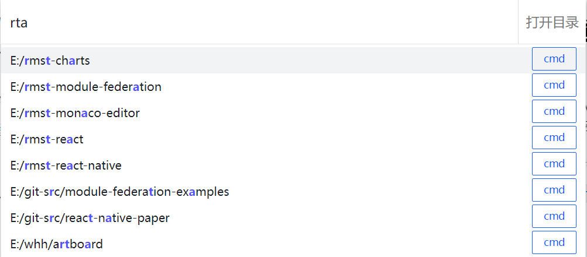

# windows 客户端

个人日常使用

- alt + 空格: 快速(非常快)使用 vscode 打开项目 (同时支持使用命令行打开) (需自行通过鼠标右击托盘图标设置项目集合所在目录)
  媲美 vscode 的跨字符搜索

  

- alt + n: 屏幕数字小键盘, 对于非全尺寸键盘 输入数字更方便

> 从 https://github.com/rmstsd/rmst-electron-old 仓库迁移

> win10-Terminal: %LOCALAPPDATA%\Microsoft\WindowsApps
